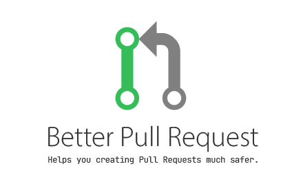
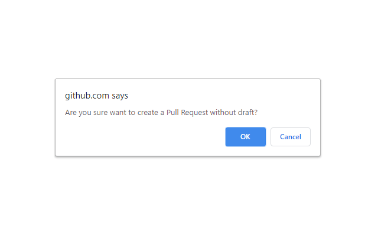

## Installation
1. Just download .crx file from [releases](https://github.com/Siketyan/BetterPullRequest/releases) to your Chrome.
1. All done!

## Features
When you are creating a Pull Request, if it is not a Draft PR, asks you are sure to create.

